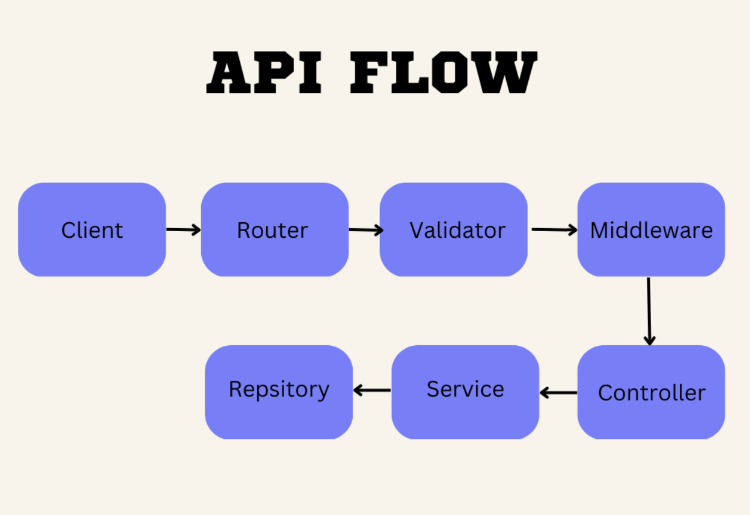

# Movies App Backend

**This app is backend of a movie app which shows all the trending movie and thier basic details which includes trailer, movie poster, movie name, movie description, movie release date and genre.**

## Folder structure

## Api Flow 

#### Technology Used
1. **NodeJs** : Backend language used to run the server
2. **ExpressJs** : Backend Frameword used on the top of backend language for the ease of development
3. **MongoDB** : Database used to store the movie details
4. **AWS S3** : S3 service of Amazon Web Services (AWS) is used to store and retrieve the movie poster images
5. **Mongoose** : ODM used to use MongoDB and interact with Js
6. **Multer** : Library to facilitate the file uploading to the server

#### Api calls

##### Movie

    GET Request "/movie/all" : get request to fetch the all movies with minimal details
        Query Parameters : NA
        Headers : NA
    
    GET Request "/movie/by/movieId" : get request to fetch the whole movie with movieId
         Query Parameters : 
            movieId (string) : unique Id of the movie
        Headers : NA

    GET Request "/movie/poster" : get request to fetch the poster image of the movie
         Query Parameters : 
            posterKey (string) : unique Id of poster of the movie 
        Headers : NA

    POST Request "/movie/add" : post request to add the movie in the database
        Body Parameters (Formdata):
            movieName  (string) : Name of the movie,
            movieDescription  (string) : Description of the movie,
            releaseDate  (string) : Release date of the movie,
            trailerLink  (string) : unique video code of youtube trailer of the movie,
            language  (string) : Language of the movie,
            movieGenres  (string Array) : Genres of the movie 
            moviePoster (image file) : Image of the movie poster
        

#### Project Setup
1. Clone this repo.
2. Create an .env file. 
3. Create an aws account and create a S3 bucket and give it a private access and then make a contract so that we can read and write the objects of the image and then create an user through IAM panel and enforce that contract.

4. Create the following environment variables
   1. MONGODB_URI : MongoDB connection string
   2. PORT : Specify the port number to run the server
   3. IAM_ACCESS_KEY : Specify the IAM access key created in above steps
   4. IAM_SECRET_ACCESS_KEY : Specify the secret IAM access key 
   5. AWS_S3_BUCKET_NAME : Specify the aws s3 bucket name
   6. AWS_S3_BUCKET_REGION : Specify the aws s3 bucket region
5. Open the terminal and run server.js file with the command node server.js

#### Thought Process while building the application
1. To store the movie details we have to design the schema and stored the basic details like trailer, movie poster, movie name, movie description, movie release date and genre.
2. For storing trailer I have to get the embed url of the youtube video so i stored the unique video Id of the youtube video as the template is same.
3. I have to store images so I have to use a storage bucket so that it can store and provide the image also. I have used AWS S3 for this.
4. I have used ES6 syntax as its the latest syntax of Js.
5. I have divided whole project into several folders such that its easy to understand.
6. Routes : Its the endpoints of the api and all the request come at this folder.
7. Validators : It validates all the requests and ensure that the request is valid and if the request is invalid it gives the user friendly error for the client.
8. Controllers : At this point request has been verified and its a valid request and we have to give the valid response so it extracts all the parameters from the request and call the specific api service.
9. Services: It provide all the business logic which is used in the app.
10. Repository: This is the only api part that interacts with DB.
11. Utils : These are the different util functions needed in the app like validation , third party service like aws s3 etc.
12. Models : It contain all the Schema used to store the data in the db. 

#### Future Scope
1. We can add pagination in order to cater a large movie data.

